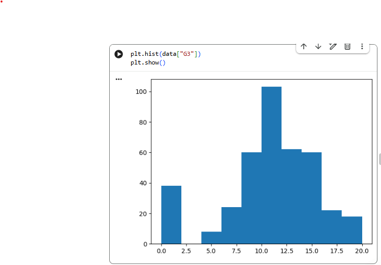
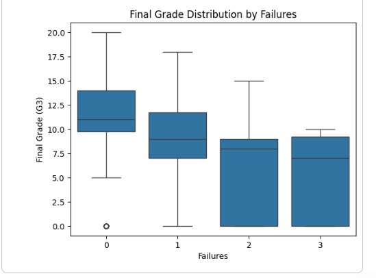
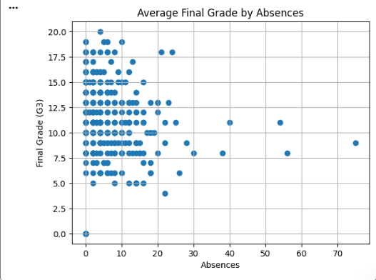
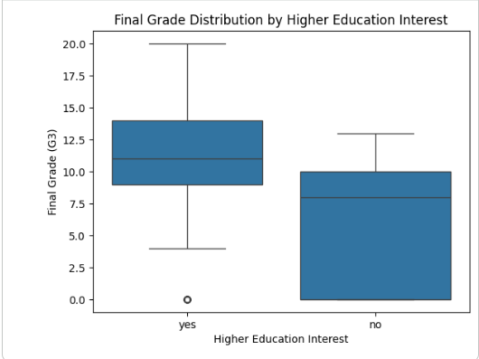

# Understanding-and-Predicting-Student-Academic-Performance

## Project Overview

This project analyzes student academic performance to understand **what drives final grades** and how students **at risk of poor outcomes can be identified early**.

Using SQL-style descriptive analysis, exploratory data analysis (EDA), and interpretable regression modeling, the project moves from **pattern discovery** to **explanation and decision-ready insight**. Rather than focusing only on prediction, the analysis is framed as an **early warning system**, emphasizing actionable signals that appear *before* final grades are assigned.

## Business / Analytical Question

**What academic, behavioral, and contextual factors most strongly influence students’ final grades, and how can these signals be used to intervene early?**

## Dataset

* **Source:** UCI Student Performance Dataset
* **Context:** Portuguese secondary school students
* **Observations:** ~395 students
* **Target variable:** `G3` (final grade, 0–20 scale)

The dataset includes academic history, attendance, study behavior, family background, social factors, and motivation indicators.

## Tools Used

* **SQL** – Pairwise and grouped descriptive analysis
* **Python** – Data cleaning, EDA, and modeling

  * pandas, matplotlib, scikit-learn
* **Optional:** Power BI (stakeholder-level summary visualization)

## Analytical Workflow (High Level)

### 1️. Data Understanding & Preparation

* Data structure inspection and summary statistics
* Missing value and duplicate checks
* Feature engineering (pass/fail indicator)

### 2️. Descriptive Analysis (SQL-Style Exploration)

Descriptive analysis was conducted using SQL-style queries to examine **one variable at a time against final grades**, grouped into:

* Academic factors
* Demographic factors
* Social and support factors

This was followed by **multi-variable summaries** (e.g., gender combined with school) to surface interaction patterns before visualization.

### 3️. Exploratory Data Analysis (EDA)

EDA was used to visualize distributions, trends, and group differences identified during descriptive analysis.

### Distribution of Final Grades

*Final grades show moderate skewness with a distinct group of low-performing students, motivating further analysis of academic risk factors.*

#### Key EDA Findings

* Final grades show **moderate skewness**, with a vulnerable low-performing group
* **Absences and prior failures** are strong negative indicators
* **Motivation (intent to pursue higher education)** strongly differentiates performance
* **Social factors**, such as romantic relationships, show measurable effects
* **Prior grades (G1, G2)** dominate correlations with final performance, motivating their removal in explanatory models

## Modeling Strategy

Two linear regression models were developed to address **different analytical goals**.

###  Model 1: Explanatory / Early Warning Model

*(Excludes G1 and G2)*

**Purpose:**
To identify **actionable drivers of performance** when interim grades are not available.

**Key Insight:**
Prior failures are the strongest negative predictor of final performance, meaning students who struggled academically in the past are significantly more likely to struggle again unless early intervention occurs. Motivation, attendance, and family context also play meaningful roles.

This model explains ~28% of the variance in final grades, which is expected for educational and social data.

###  Model 2: Predictive Academic Model

*(Includes G1 and G2)*

**Purpose:**
To maximize predictive accuracy when prior academic performance is known.

**Key Insight:**
First- and second-period grades dominate predictions. While effective for forecasting outcomes, this model provides limited insight into *why* students succeed or struggle.

### Why Two Models?

This comparison highlights the trade-off between:

* **Prediction:** forecasting outcomes accurately
* **Explanation:** identifying factors educators can act on early

Both perspectives are valuable, depending on the decision-making context.

## Key Insights 

  ### Past Failures vs Final Grade

*Students with prior course failures consistently achieve lower final grades, indicating that academic difficulty compounds over time without early intervention.*

 ### Absences vs Final Grade

*Final grades decline sharply as absences increase, particularly beyond a critical threshold, highlighting attendance as a key early warning indicator.*

 ### Study Time vs Final Grade

*Students who study more hours per week tend to achieve higher median final grades, with less variability among high-study groups.*

### Higher Education Intent vs Final Grade

*Students who plan to pursue higher education consistently outperform peers, suggesting that long-term academic motivation strongly influences outcomes.*

* **Past failures are the strongest risk factor.**
  Students who failed previously are much more likely to perform poorly again, suggesting academic difficulty compounds over time.

* **Motivation matters.**
  Students who aspire to higher education consistently achieve higher final grades, indicating that goal-setting and long-term aspirations play a meaningful role in performance.

* **Attendance is a powerful early signal.**
  Grades decline sharply as absences increase, especially beyond a threshold.

* **Family environment and parental background matter.**
  These factors provide important context for student outcomes.

* **Support variables require careful interpretation.**
  Lower grades among students receiving school support likely reflect targeted assistance for struggling students rather than a negative effect of support itself (selection bias).

## Recommendations

Based on the findings, the analysis suggests:

* **Early intervention** for students with prior failures
* **Encouraging goal-setting** and higher education aspirations
* **Family engagement initiatives** to support learning at home
* **Earlier monitoring of students receiving school support**

These actions focus on prevention rather than remediation.

## Early Warning System Perspective

By excluding interim grades and focusing on behavioral and contextual variables, this project demonstrates how students at risk of poor final outcomes can be identified **early in the academic cycle**.

This framework demonstrates how analytics can support:

* Proactive academic support
* Targeted intervention
* Data-informed educational policy decisions

## Limitations

* Observational data does not imply causation
* Several variables are self-reported
* Findings are specific to one educational context
* Linear regression assumes linear relationships

Future work could explore non-linear models and external validation.

## Conclusion

This project demonstrates an end-to-end analytical workflow, from descriptive analysis and visualization to interpretable modeling and actionable insight. By distinguishing between predictive accuracy and explanatory clarity, the analysis supports both forecasting and early intervention, transforming analysis into **decision-ready insight**.

## Repository Notes

* This README provides a **high-level summary** of findings and insights
* The **full step-by-step analysis**, including SQL queries, visualizations, and modeling code, is available in the accompanying Jupyter notebook

## Author

**Favour Odiyo**
Data Analyst | Python | SQL | Analytics

